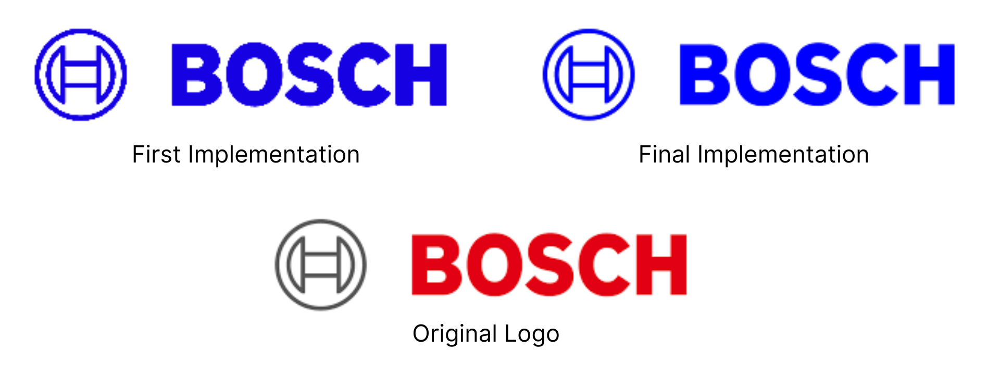

# Bosch-Programming-Challenge

## Objective
The goal of this programming task is to create a command-line utility that transforms the Bosch logo by applying user-specified colors while maintaining image quality. Users can input any HEX or RGB color code to generate logo variants for campaign experimentation and brand customization.
## Implementation

Since the goal was to recolor the logo, my initial implementation involved modifying all non-white pixels into the user-specified color. This initial method worked, but caused the output logo to appear a bit more pixelated than the original.

In the original logo, lighter colored pixels surrounded logo to smoothen out the borders and make the logo sharper. But by changing the lighter-colored pixels into the desired color, the resulting output was a rough-edged logo that looks more pixelated than the original.
### 💡 The Solution
Implement anti-aliasing, a technique that's commonly used to smooth jagged edges in digital images by using transitional pixels along the boundary to blend the foreground color with the background, creating the look of smoother curves and diagonals.

To implement this, I introduced a `white_threshold` and blending functionality. Pixels with r, g, and b values above this threshold are ommitted from the color change. Pixels below this threshold receive gradual recoloring based on their brightness - darker pixels get full color application while lighter pixels get partial blending. This preserves the anti-aliased edges by maintaining the smooth brightness transitions that create the appearance of smooth borders, resulting in a professional-looking recolored logo that maintains the original image quality.

The blending system uses linear interpolation between the original pixel colors and the target color, creating smooth gradients that prevent harsh edges and maintain the logo's visual integrity across all color transformations.



## Installation
In the desired directory, clone the repository and install the required dependencies if they are not already present.

```bash
# Clone the repository
git clone https://github.com/wycg22/Bosch-Programming-Challenge.git
cd Bosch-Programming-Challenge

# Install dependencies
pip install Pillow numpy
```
## Usage
This utility takes a PNG input of the original logo and a **string** input of the HEX or RGB color code (the supported input formats can be found below). There is also an optional input parameter for the output file name. The output PNG will be located in the same directory as the input PNG unless a directory is specified using the optional output filename parameter.

### Basic Commands
```bash
# Changing the logo to the color blue
python LogoRecolor.py  Bosch-logo.png "#0000FF"         # HEX input
python LogoRecolor.py  Bosch-logo.png "(0,0,255)"       # RGB input
python LogoRecolor.py  Bosch/Bosch-logo.png "(0,0,255)" # If the input PNG is in a different directory

#Other supported input strings
python LogoRecolor.py  Bosch-logo.png "0000FF"       # HEX input without the #
python LogoRecolor.py  Bosch-logo.png "#0000ff"      # HEX input is not case-sensitive
python LogoRecolor.py  Bosch-logo.png "#00F"         # Abbreviated HEX (00F represents 0000FF)
python LogoRecolor.py  Bosch-logo.png "0,0,255"      # RGB code without parentheses () 
python LogoRecolor.py  Bosch-logo.png "RGB(0,0,255)" # RGB is specified in the input

```
If there is an error in the input string, you will see this Error message in the terminal:
```bash
❌ Error: Invalid color format: FF,FF,FF. Use HEX (e.g. FF0000) or RGB (e.g. rgb(255,0,0)).
```

### Output Filename Parameter
By default, the output file is named (input filename)\_recolored\_rgb(\*desired color code\*). But by adding a <code>-o</code> flag, you can specify what you want the output filename to be. 

Here is an example of how it can be used:
```bash
# Default
python LogoRecolor.py  Bosch-logo.png "0,0,255"         # Output PNG is named Bosch-logo_recolored_rgb(0,0,255).png
python LogoRecolor.py  .\Bosch\Bosch-logo.png "0,0,255"   # Output PNG will be saved to the same directory as the input

# With output parameter
python LogoRecolor.py  Bosch-logo.png "0,0,255" -o blue.png             # Output PNG is named blue.png
python LogoRecolor.py  Bosch-logo.png "0,0,255" -o ./Bosch/blue.png     # Output PNG is saved to the Bosch directory
```

## Testing
The repository includes a unit test file `RecolorTest.py` to ensure reliability and correctness across all functionality. The test suite covers color conversion, image processing, and integration workflows.

The test file contains three main classes:
- TestColorConverter - Tests for valid color code inputs and proper parsing of the input string.
- TestNonWhiteRecolorer - Verifies the recoloring logic of the code
- TestIntegration - Tests the full process from input to output

To execute the test, run:
```bash
python RecolorTest.py
```

